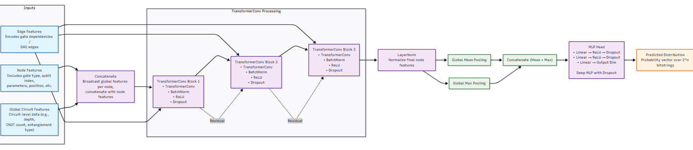
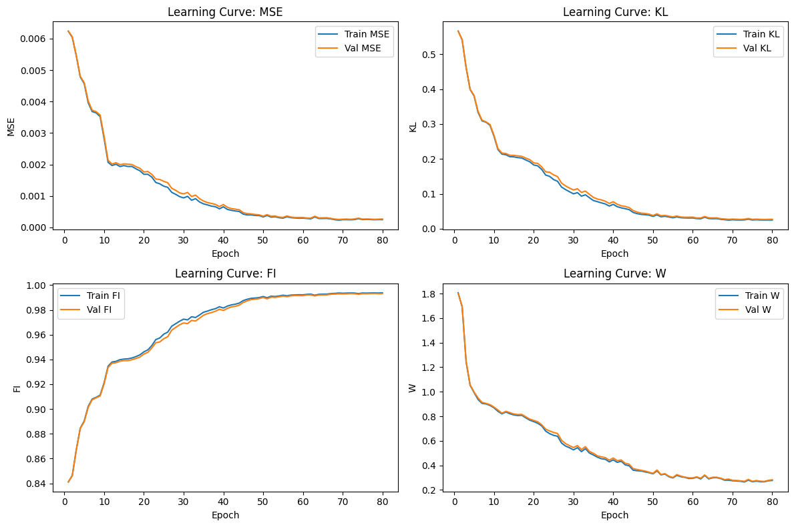

# Evaluating the Learnability of Transformer-Based Graph Neural Networks for the Output Distributions of Quantum Circuits


This repository contains all code, data, models, and analysis supporting the thesis **"Evaluating the Learnability of Transformer-Based Graph Neural Networks for the Output Distributions of Quantum Circuits."**

This work investigates whether **TransformerConv-based Graph Neural Networks (GNNs)** can effectively learn the **full joint output probability distributions** of quantum circuits. It examines the learnability, scalability, and generalization behavior of GNNs relative to a deep Convolutional Neural Network (CNN) baseline under varying circuit structures, noise conditions, and qubit counts.

---

## Overview

The core objective of this thesis is to model the **complete output distribution** of a quantum circuit, i.e., the probability of observing each possible $2^n$ bitstring for an $n$-qubit quantum system. Unlike prior work focusing on scalar properties (e.g., fidelity or expectation values), this thesis treats the output distribution as the primary supervised target, using classical deep learning to approximate it.

Key elements of the thesis include:

- Focus on **multi-output regression**: full distribution prediction across up to 32 bitstrings (5 qubits)
- Evaluation across **circuit classes** (variational vs. QAOA-like), **noise levels**, and **qubit scales**
- Comprehensive comparison between **graph-based (GNN)** and **sequence-based (CNN)** architectures
- **Extrapolation** test to unseen 6-qubit circuits under zero-shot and few-shot settings


## Motivation

Understanding whether classical neural networks can approximate the full output distributions of quantum circuits is essential for evaluating the role of machine learning in quantum system modeling. This thesis investigates whether **Graph Neural Networks (GNNs)**, when equipped with structural and parametric features of quantum circuits, can learn to predict **joint output distributions** over $2^n$ measurement outcomes.

Unlike prior work that focuses on scalar observables such as expectation values or fidelity, this thesis targets the **distribution-level behavior** of quantum circuits. The central objective is to assess whether high-dimensional output distributions can be learned from circuit structure, gate parameters, and calibration-based noise attributes using classical neural models.

The thesis is restricted to circuits with 2 to 5 qubits, with extrapolation experiments on 6-qubit circuits. This range remains practically relevant: as of 2024, the median number of qubits used in quantum applications is 6, and the average is 10.5, reflecting growing complexity in near-term quantum hardware.

The results are relevant for the development of classical neural-network-based surrogates in:

- Quantum benchmarking
- Noise-aware circuit evaluation

By analyzing learnability across circuit classes and noise regimes, this work contributes a **distribution-level benchmark** that informs both the practical use of neural predictors and the broader question of classical modeling limits in quantum computing.


## Key Contributions

This thesis introduces and validates a complete framework for learning full quantum output distributions using Transformer-based GNNs:

- Structured dataset of over 144,000 circuits spanning:
  - Qubit sizes: 2 to 5 for training, 6 for extrapolation
  - Circuit classes: Class A (Variational Ansatz) and Class B (QAOA-like)
  - Noise regimes: Ideal and hardware-calibrated noisy simulations

- Graph Transformer (TransformerConv) model using:
  - Gate-level DAG representations
  - Rich node features (gate type, parameters, noise)
  - Laplacian positional encodings
  - Global circuit attributes (depth, CX count, error rates)

- Sequence CNN baseline using 1D convolutions over gate sequences with matched parameter scaling

- Transfer learning across qubit levels (2→3→4→5) with layer freezing and weight interpolation

- Zero-shot and few-shot extrapolation to 6-qubit circuits with detailed performance analysis

- Evaluation using multiple distributional metrics:
  - Kullback–Leibler (KL) divergence
  - Classical fidelity
  - Mean squared error (MSE)
  - Wasserstein distance


## Repository Structure

```
├── datasets/ # Quantum‑circuit graph datasets (.pt)
│ ├── {2‑,3‑,4‑,5‑,6‑}qubit/ # qubit‑count top level
│ │ ├── noiseless/ # noise‑free simulations
│ │ │ └── class{A,B}/ # circuit class
│ │ │ └── dataset_⋯.pt
│ │ └── noisy/ # hardware‑calibrated simulations
│ │ ├── calibration_⋯.json # IBM‑device snapshot used to build noise model
│ │ └── class{A,B}/
│ │ └── dataset_⋯.pt
├── figures/ # Static images referenced in the README / thesis
│ ├── circuits/ # circuit diagrams
│ ├── gnn/metrics/ # GNN learning‑curve & box‑plot PNGs
│ └── cnn/metrics/ # CNN counterparts
├── models/
│ ├── gnn_models/ # Trained Graph‑Transformer checkpoints (2 q → 5 q)
│ └── cnn_models/ # Trained CNN checkpoints (2 q → 5 q)
├── notebooks/ # End‑to‑end Jupyter workflows
│ ├── 1_circuits_data_generation.ipynb
│ ├── 2_data_exploration.ipynb
│ ├── 3_gnn_modeling.ipynb
│ ├── 4_cnn_modeling.ipynb
│ ├── 5_extrapolation_data_gen.ipynb
│ ├── 6_gnn_extrapolation.ipynb
│ ├── 7_cnn_extrapolation.ipynb
│ └── gnn_kl-fid_boxplot_visualization.ipynb
├── requirements.txtx # Python dependency versions
├── .gitignore # Ignore caches, checkpoints, OS artefacts
└── .gitattributes # Git LFS pointers for large *.pt / *.json files
```

**Key points**

* **Datasets** are grouped first by qubit size (2 q – 6 q), then by noise regime, circuit class, and finally by `.pt` file.  
  Each *noisy* folder also stores the IBM calibration JSON used for simulation.

* **Models** follow the same naming convention (`2q_cnn.pt`, `3q_gnn.pt`, …) and are saved after training.

* **notebooks/**: Step‑by‑step Jupyter workflows covering data generation, exploration, training, extrapolation, and figure creation.

* **figures/** Contains static image referenced by the README and thesis, grouped into sub‑folders for clarity.

* Large binaries (`*.pt`) are version‑controlled via **Git LFS**, as declared in `.gitattributes`.


* The **requirements.txt** file specifies library versions used in the thesis experiments.


## Table of Contents

* [Overview](#overview)
* [Motivation](#motivation)
* [Key Contributions](#key-contributions)
* [Repository Structure](#repository-structure)

* [Quantum Circuit Design](#quantum-circuit-design)
  * [Class A: Variational Ansatz Circuits](#class-a-variational-ansatz-circuits)
  * [Class B: QAOA‑Like Circuits](#class-b-qaoa-like-circuits)
  * [Structural Comparison](#structural-comparison)

* [Dataset Description](#dataset-description)

* [Simulation Settings](#simulation-settings)
  * [Noiseless Simulations](#noiseless-simulations)
  * [Noisy Simulations (Hardware‑Calibrated)](#noisy-simulations-hardware-calibrated)

* [Dataset Scaling and Sampling Strategy](#dataset-scaling-and-sampling-strategy)
* [Data Diversity and Entropy Analysis](#data-diversity-and-entropy-analysis)

* [Model Architectures](#model-architectures)
  * [Graph Transformer GNN](#graph-transformer-gnn)
  * [CNN Baseline](#cnn-baseline)
  * [Parameter Scaling](#parameter-scaling)

* [Training and Evaluation](#training-and-evaluation)
  * [Transfer Learning](#transfer-learning)
  * [Optimization](#optimization)
  * [Evaluation Metrics](#evaluation-metrics)

* [Training Results and Model Evaluation](#training-results-and-model-evaluation)
  * [Learning Curves (Training & Validation)](#learning-curves-training-validation)
  * [Test‑Set Metrics](#test-set-metrics)
  * [Metric Distributions (Test Set)](#metric-distributions-test-set)
  * [Predicted vs. True Distributions](#predicted-vs-true-distributions)

* [Extrapolation to 6‑Qubit Circuits](#extrapolation-to-6-qubit-circuits)
  * [Zero‑Shot Extrapolation](#zero-shot-extrapolation)
  * [Few‑Shot Fine‑Tuning](#few-shot-fine-tuning)

* [Key Findings](#key-findings)
  * [Accuracy Across Trained Qubit Sizes](#accuracy-across-trained-qubit-sizes)
  * [Performance Under Noise](#performance-under-noise)
  * [Scaling Behavior](#scaling-behavior)
  * [Model Comparison](#model-comparison)

* [Future Work](#future-work)


## Quantum Circuit Design

This thesis investigates two structurally distinct families of quantum circuits designed to test the learnability of full output distributions:

### Class A: Variational Ansatz Circuits

These circuits emulate hardware-efficient ansätze with shallow, sparse structures.

- **Parameterized RY rotations** on all qubits in each layer
- **Sparse entanglement** using CNOTs between alternating neighboring qubits `(i, i+1)` for even `i`
- **Circuit depth** scales with qubit count:  
  `depth = max(1, floor(n_qubits / 2))`


### Class B: QAOA-Like Circuits

These circuits resemble Quantum Approximate Optimization Algorithm (QAOA) circuits and are structurally deeper.

- **Initial Hadamard gates** prepare uniform superpositions
- **Entangling blocks**: CX–RZ–CX applied to alternating pairs `(i, i+1)` for even `i`
- **All parameterized angles** (RZ and RX) are sampled uniformly from [0, 2π]
- **Mixer blocks**: RX gates with parameterized angles on all qubits
- **Depth** defined as QAOA layer count `p = max(1, floor(n_qubits / 2))`


### Structural Comparison

The following table summarizes the differences in gate depth, gate count, and gate diversity between Class A and Class B circuits for 2–5 qubits.

**Circuit Properties Across Qubit Sizes**

| Qubits | A Depth | B Depth | A Gates | B Gates | A CXs | B CXs | A RYs | B RXs | B RZs | B Hs |
|--------|---------|---------|---------|---------|--------|--------|--------|--------|--------|-------|
| 2      | 2       | 5       | 3       | 7       | 1      | 2      | 2      | 2      | 1      | 2     |
| 3      | 3       | 8       | 5       | 12      | 2      | 4      | 3      | 3      | 2      | 3     |
| 4      | 4       | 9       | 12      | 24      | 4      | 8      | 8      | 8      | 4      | 4     |
| 5      | 5       | 6       | 15      | 16      | 6      | 6      | 10     | 10     | 6      | 5     |


## Dataset Description

Quantum circuit datasets are generated using Qiskit and saved in the `datasets/` directory. For each qubit size (2 to 5), the following variations are created:

- **Circuit class**: Class A and Class B
- **Noise setting**: Noiseless (ideal) and noisy (hardware-calibrated)

Each dataset is a `.pt` file containing:

- `x`: Node features including:
  - Gate parameters (e.g., rotation angles as sin/cos)
  - Gate type (one-hot encoded)
  - Qubit index (one-hot encoded over MAX_QUBITS)
  - Qubit-specific calibration parameters (T1, T2, readout error)
  - Gate error
  - Topological features: normalized node index, normalized node degree
  - Laplacian positional encodings (K=6)

- `edge_index`: Tensor of shape [2, num_edges], representing forward-only edges in the circuit DAG

- `edge_attr`: Edge features including:
  - Normalized topological distance between gates
  - CX indicator
  - Gate error

- `pos`: Topological position index for each node (0 to N−1)

- `u`: Global circuit-level features including:
  - Normalized circuit depth
  - Normalized CNOT count
  - Entanglement indicator
  - Normalized single-qubit gate count
  - Graph density
  - Mean qubit calibration values (T1, T2, readout error)
  - Mean gate error

- `y`: Target output probability distribution (length $2^n$)

Circuit DAGs are created using Qiskit’s `circuit_to_dag()` method and converted using a topological traversal that preserves gate execution order and dependencies.


## Simulation Settings

### Noiseless Simulations

- Performed on Qiskit's **ideal simulator**
- Output distributions are determined solely by unitary evolution and measurement, without any stochastic noise
- Serve as a baseline to evaluate model learnability in the absence of hardware-induced variability

### Noisy Simulations (Hardware-Calibrated)

- Use IBM hardware calibration data (e.g., T1, T2, gate errors, readout error)
- Simulated using `AerSimulator.from_backend()`
- Noise parameters saved with each dataset (`*.json`)
- Captures realistic decoherence, gate infidelity, and readout noise

These two settings allow models to be evaluated under both ideal and real-world-inspired regimes.


## Dataset Scaling and Sampling Strategy

To ensure consistent learning difficulty across circuit sizes, datasets are generated with a **fixed number of samples per output bitstring**:

- For each qubit count `n`, generate **1,200 samples per bitstring** (output dimension $2^n$)
- Balanced across:
  - Class A and Class B (600 samples each)
  - Noiseless and noisy settings

**Sample Counts per Qubit Level (per noise setting)**

| Qubits | Bitstrings | Total Samples    |
|--------|------------|------------------|
| 2      | 4          | 4 × 1200 = 4,800 |
| 3      | 8          | 9,600            |
| 4      | 16         | 19,200           |
| 5      | 32         | 38,400           |

Each dataset is further split into **70% train, 20% validation, 10% test**, stratified by output bitstring to preserve balance.

*Note:  Multiply by 2 to obtain the full total for each qubit size when both noise settings (noiseless + noisy) are included.*


## Data Diversity and Entropy Analysis

To quantify and preserve output‑distribution diversity, each target vector is scored with **Shannon entropy**.

- **Mean entropy** is reported for the training, validation, and test splits; similar values across splits confirm that diversity is evenly represented.  
- **Stratified splitting** preserves the entropy distribution, ensuring that outputs spanning the full range from low to high entropy are proportionally represented in every subset.

These checks ensure that the models are trained and evaluated on a broad, representative range of output distributions rather than a narrow band of low‑entropy cases.

## Model Architectures

This repository compares two distinct neural architectures for predicting full quantum output distributions:

- A **Graph Neural Network (GNN)** using TransformerConv layers
- A **Convolutional Neural Network (CNN)** baseline using 1D convolutions over gate sequences

Both models are trained and evaluated on the same datasets, with matched parameter scaling, transfer learning, and metric pipelines.


### Graph Transformer GNN

The GNN models the circuit as a **DAG-based graph**, where nodes represent gates and edges represent time-ordered dependencies.

#### Node Features

Each node includes the following features:

- **Gate parameters** (rotation angles) encoded via `[sin(θ), cos(θ)]`
- **Gate type** encoded as a one-hot vector
- **Qubit index** one-hot encoding
- **Noise attributes**: T1, T2, readout error, gate error
- **Normalized node degree** and **topological index**
- **Topological position** (position in DAG order)
- **Laplacian positional encodings**: 6 smallest non-trivial eigenvectors

These features are concatenated and passed through learnable embedding layers.

#### Global Features

Each circuit is also represented with global attributes:

- Normalized circuit depth
- CNOT gate count
- Gate diversity statistics
- Mean hardware noise parameters

Global features are injected into node embeddings **before** message passing (early fusion), allowing structural and global context to interact throughout the network.

#### TransformerConv Layers and Attention

The GNN uses `TransformerConv` layers (from PyTorch Geometric), which include:

- Multi-head attention over node neighborhoods
- Built-in edge encoding (e.g., CX flag, normalized distance)
- Residual connections for stability

The number of TransformerConv layers scales with the number of qubits (2–5), allowing deeper reasoning for larger circuits.

#### Pooling and Output

After message passing:

- **Mean pooling + Max pooling** over node embeddings
- Concatenated representation passed to a multi-layer perceptron (MLP)
- MLP output size = $2^n$ (full joint distribution)
- **Softmax normalization** ensures valid output probability distribution

**Architecture Diagram**




### CNN Baseline

The CNN baseline treats circuits as **sequences of gates**. Each circuit is flattened into a 1D sequence of node feature vectors and padded to a fixed length (40).

#### Model Components

- **Conv1D layer**: kernel size 5, applied to padded gate sequences
- **Global circuit features** projected via linear layer
- **Concatenation** of sequence and global embeddings
- **Three-layer MLP** head to output full distribution
- Final softmax normalization

#### Scaling Strategy

To match GNN capacity, the CNN hidden dimension increases with qubit count:

```python
hidden_dim = hidden_2q if n == 2 else int(hidden_2q * (n - 1) * 1.3)
````

This ensures that both architectures are compared fairly in terms of parameter count.

**Architecture Diagram**


### Parameter Scaling

Each model's parameter count is scaled proportionally to circuit complexity.

**Parameter Count per Architecture**

| Qubit Count | CNN Parameters | GNN Parameters |
| ----------- | -------------- | -------------- |
| 2 qubits    | 313,204        | 232,564        |
| 3 qubits    | 1,211,768      | 936,440        |
| 4 qubits    | 2,698,936      | 2,406,616      |
| 5 qubits    | 4,782,272      | 4,926,200      |


## Training and Evaluation

Both models are trained on stratified datasets with consistent preprocessing, loss functions, and learning schedules.

### Transfer Learning

Training progresses sequentially from 2 to 5 qubits. At each stage:

* The model from the previous qubit level is partially reused
* Weight transfer uses **shape-aware interpolation**
* Early layers are **frozen for 10 epochs**, then unfrozen for joint optimization

This reduces training time and helps retain useful inductive biases from smaller circuits.

### Optimization

* Optimizer: **Adam**
* Learning rate: `0.0001`
* Epochs:

  * 2q: 31 epochs
  * 3q: 50 epochs
  * 4q: 80 epochs
  * 5q: 90 epochs

### Evaluation Metrics

Each model is evaluated using the following distributional metrics:

* **KL Divergence** (primary loss)
* **Classical Fidelity**
* **Mean Squared Error (MSE)**
* **Wasserstein Distance**


## Training Results and Model Evaluation

The models were evaluated across 2 to 5 qubits using stratified splits and multiple distributional metrics. All results reflect test set performance and are grouped by circuit class (A or B) and noise setting (noiseless or noisy).


### Learning Curves (Training & Validation)

For each qubit size (2 – 5) the plots below track **KL divergence, MSE, classical fidelity, and Wasserstein distance** over epochs for both training and validation sets. The accompanying notes summarise the main quantitative trends drawn from Section 4.1.


#### 2‑Qubit Results

| Model | Final KL ↓ | Final Fidelity ↑ | Notes |
|-------|------------|------------------|-------|
| **GNN** | **0.010 / 0.011** (train/val) | **0.997 / 0.997** | Converges within 15 epochs; curves for all four metrics overlap closely, indicating stable generalisation. |
| **CNN** | 0.069 / 0.070 | 0.980 / 0.979 | Requires > 20 epochs to reach KL ≈ 0.07; learning curves exhibit mild oscillations, especially in Wasserstein. |

**GNN**


**CNN**


#### 3‑Qubit Results

| Model | Final KL ↓ | Final Fidelity ↑ | Notes |
|-------|------------|------------------|-------|
| **GNN** | **0.0067 / 0.0069** | **0.998 / 0.998** | Error drops sharply during freeze phase (first 10 epochs) and continues smooth improvement after unfreezing. |
| **CNN** | 0.029 / 0.029 | 0.991 / 0.991 | Layer unfreezing accelerates early learning, but curves flatten after epoch 30; small metric oscillations persist. |

**GNN**


**CNN**


#### 4‑Qubit Results

| Model | Final KL ↓ | Final Fidelity ↑ | Notes |
|-------|------------|------------------|-------|
| **GNN** | **0.025 / 0.027** | **0.994 / 0.993** | Maintains smooth convergence despite output size doubling; training‑validation curves remain overlapped. |
| **CNN** | 0.513 / 0.539 | 0.854 / 0.849 | Improvement slows markedly after unfreezing; KL plateaus around 0.54 and fidelity stalls near 0.85. |

**GNN**



**CNN**


#### 5‑Qubit Results

| Model | Final KL ↓ | Final Fidelity ↑ | Notes |
|-------|------------|------------------|-------|
| **GNN** | **0.025 / 0.028** | **0.993 / 0.993** | Scales to 32‑dimensional outputs with continued smooth decline in all error metrics. |
| **CNN** | 0.570 / 0.705 | 0.839 / 0.811 | Curves display noticeable oscillations; Wasserstein remains > 2.7, confirming difficulty at highest dimension. |

**GNN**


**CNN**


#### Summary of Convergence Behaviour

* The **GNN** converges rapidly and retains nearly identical training/validation trajectories at every qubit size, demonstrating strong generalisation and stable optimisation.  
* The **CNN** shows acceptable convergence at 2 – 3 qubits but increasing lag, oscillation, and error variance from 4 qubits onward, reflecting its reduced capacity to capture long‑range dependencies in deeper circuits.

### Test-Set Metrics

Quantitative summary across **all test samples** (all circuit groups combined) for each qubit size. Reported values are **means**.

| Qubits | Model | KL ↓ | Fidelity ↑ | MSE ↓ | Wasserstein ↓ |
|-------:|:------|------:|-----------:|------:|--------------:|
| **2** | GNN | **0.0103** | **0.9975** | **8.4e-4** | **0.059** |
|       | CNN | 0.0724 | 0.9788 | 7.4e-3 | 0.148 |
| **3** | GNN | **0.0068** | **0.9983** | **1.9e-4** | **0.095** |
|       | CNN | 0.0297 | 0.9914 | 7.4e-4 | 0.179 |
| **4** | GNN | **0.0259** | **0.9936** | **2.6e-4** | **0.283** |
|       | CNN | 0.5241 | 0.8517 | 5.9e-3 | 1.694 |
| **5** | GNN | **0.0261** | **0.9932** | **7.0e-5** | **0.430** |
|       | CNN | 0.6056 | 0.8319 | 2.0e-3 | 2.762 |

#### Highlights by Qubit Size

- **2 q:** GNN fidelity > 0.997; KL < 0.011 across all groups. CNN KL ~ 0.07; Wasserstein > 2× GNN in every setting.  
- **3 q:** GNN fidelity > 0.993; KL < 0.03 in all groups. CNN begins to lag on Class B (KL ~ 0.047; W > 0.21).  
- **4 q:** GNN fidelity ~ 0.994; KL < 0.028. CNN degrades sharply — on Class A noiseless, KL > 1.15, W > 4.2, FI ~ 0.69.  
- **5 q:** GNN fidelity > 0.99; KL < 0.041; W ≈ 0.34–0.60 across groups. CNN especially weak on Class A noiseless (KL > 1.32; FI < 0.65).


### Metric Distributions (Test Set)

Boxplots summarize model accuracy across all evaluation metrics and circuit conditions.

| Qubit size | Graph‑Transformer GNN | CNN Baseline                                      |
|------------|----------------------|---------------------------------------------------|
| **2 qubits** |  |  |
| **3 qubits** |  |  |
| **4 qubits** |  |  |
| **5 qubits** |  |  |


#### Interpretation

The boxplots reveal three key trends:

1. **Consistent precision of the GNN.**  
   *2 q:* KL ≈ 0.010 with most samples < 0.03 and fidelity > 0.98.  
   *3 q:* KL ≈ 0.0068; the inter‑quartile range is below 0.01, indicating very tight error spread.  
   *4–5 q:* KL means stay below 0.03 and fidelity medians hover around 0.994, confirming stable generalization across circuit classes and noise settings.

2. **Progressive variance inflation in the CNN.**  
   *2 q:* KL ≈ 0.072 and the upper whisker approaches 0.75.  
   *3 q:* The inter‑quartile range roughly doubles and outliers reach KL > 0.4.  
   *4–5 q:* Median KL rises to ≈ 0.44–0.49 and extreme values exceed 3.0, signalling increasing difficulty as depth and output space grow.

3. **Wasserstein distance mirrors KL behaviour.**  
   For the GNN, Wasserstein distance increases modestly from ≈ 0.06 (2 q) to ≈ 0.43 (5 q) and remains below 1.0 throughout.  
   CNN values exceed 1.5 at 4 q and reach ≈ 2.8 at 5 q, showing large probability‑mass shifts the CNN fails to capture at higher circuit complexity.

From that we can deduce that the Transformer‑based GNN maintains low‑variance, high‑accuracy predictions up to 5 qubits, whereas the convolutional baseline exhibits widening error distributions as circuit complexity and output dimension increase.

### Predicted vs. True Distributions

Example comparisons of predicted output probabilities against the true distributions.

**2 qubits**  
  
**3 qubits**  
  
**4 qubits**  
  
**5 qubits**  


## Extrapolation to 6-Qubit Circuits

Models trained on 5-qubit circuits were evaluated on a new dataset of 6-qubit circuits in two settings:

### Zero-Shot Extrapolation

- Output layer resized to 64 dimensions
- Models evaluated directly with no retraining
- Performance drops observed (KL > 0.89, Fidelity ~ 0.76)

### Few-Shot Fine-Tuning

- 200 circuits used for adaptation over 15 epochs
- GNN shows slightly better recovery than CNN:
  - GNN: KL ~ 0.8524, Fidelity ~ 0.7612
  - CNN: KL ~ 0.8679, Fidelity ~ 0.7606

These results confirm the difficulty of extrapolating to larger Hilbert spaces, even with partial supervision.


## Key Findings

The following observations summarize the results of all evaluations:

### Accuracy Across Trained Qubit Sizes

- GNN performance remains strong across all qubit levels
- CNN performance degrades sharply at 4 and 5 qubits

### Performance Under Noise

- Both models perform better on noisy datasets
- GNN exploits noise-aware node features (T1, T2, gates and readout error)
- A plausible reason is that hardware noise can soften extremely sharp probability peaks, making the resulting distributions slightly easier to approximate—though this effect was not isolated experimentally

### Scaling Behavior

- GNN scales reliably with deeper DAGs and larger output spaces
- CNN struggles with long-range dependencies and deeper sequences

### Model Comparison

| Criterion                       | GNN                                                                         | CNN Baseline                                                                          |
| ------------------------------- |-----------------------------------------------------------------------------| ------------------------------------------------------------------------------------- |
| **Accuracy (2 – 5 qubits)**     | Maintains low KL (< 0.03) and high fidelity (> 0.99) at every qubit size    | Comparable at 2 – 3 q but error grows markedly at 4 q and 5 q                         |
| **Training Dynamics**           | Reaches convergence quickly; learning curves remain smooth and monotonic    | Slower convergence; noticeable oscillations and early plateaus at higher qubit counts |
| **Scalability**                 | Handles deeper DAGs and 32‑dimensional outputs without performance collapse | Struggles with long‑range dependencies as circuit depth and output dimension expand   |
| **6‑Qubit Few‑Shot Adaptation** | KL ≈ 0.85, Fidelity ≈ 0.76 (modest recovery)                                | KL ≈ 0.87, Fidelity ≈ 0.76 (slightly weaker recovery)                                 |

## Future Work

Future research directions include evaluating model performance on real quantum hardware to assess robustness under actual noise and device-specific imperfections. Broader circuit diversity—through varied gate sets and entanglement patterns—could reveal which structural properties most affect learnability. It is also important to analyze how different types and magnitudes of noise impact performance. Scaling to circuits with 6–8 qubits (and beyond) would help determine the limits of model generalization in higher-dimensional output spaces. Another direction is to test generalization to unseen circuit families at qubit sizes similar to those used in training, offering insight into the model’s ability to transfer across structural classes.

## Conclusion

This thesis demonstrates that TransformerConv-based Graph Neural Networks can effectively learn the full output distributions of quantum circuits across varying qubit sizes, circuit types, and noise conditions. The GNN consistently outperforms a parameter-matched CNN baseline in accuracy, convergence, and scalability, especially at higher qubit counts (4–5 qubits).

Extrapolation experiments on 6-qubit circuits confirm the difficulty of generalizing to larger Hilbert spaces. While both models show degraded performance in zero-shot settings, few-shot fine-tuning yields modest recovery. These results highlight the potential—and the limitations—of using classical graph-based deep learning models as surrogates for quantum circuit behavior.

The proposed framework offers a reproducible benchmark for investigating distribution-level learnability in quantum systems and serves as a foundation for future exploration of scaling, generalization, and real-device evaluation.
